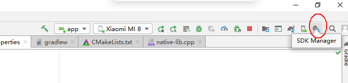
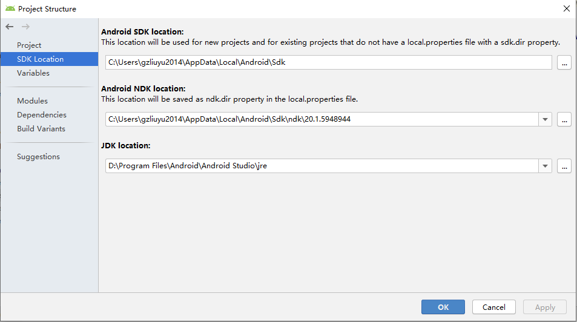

# NDK

上一篇学习了jni之后，下面开始在安卓平台下应用jni，目前游戏引擎的做法通常都是用java启动app，然后再加载native的库。原先的引擎在build native代码的时候通常采用的是ndk-build的方式，而目前AndroidStudio官网提供的方式是CMake编译，这也可能也是官方推荐的方式，因为目前官网没有对ndk-build作过多的介绍，只是简单说明新版AndroidStudio可以兼容ndk-build的方式。目前包括Messiah引擎在内的引擎，在android平台下的工程文件，都会对不同的库有Android.mk文件，这个.mk文件其实就是ndk-build的时候需要用到的脚本文件。而官方推荐的cmake方式则是通过CMakeLists.txt描述编译规则的。

AndroidStudio其实对native的方式支持已经比较好了，只是在搭建环境的时候也踩了一些坑。这里列一下我这里的版本（AndroidStudio3.5.3）的环境搭建流程。

* 新建工作->Native C++->下一步，选择java版本和c++的版本->finish
* 通过File->Settings->Appearance&Behavior->System Setttings->Android SDK打开SDK Manager，或者点击
* 在SDK Tools里安装NDK，CMake， LLDB。
* 在File->Project Structure里设置SDK Location. 
* 将刚刚下载的ndk配置到ndk location当中，否则不能编译。
* cmake也可以参照Android Studio官方文档提供的方式用自定义的cmake版本。
* 完成以上设置之后，插上安卓手机，打开USB调试点击运行，应该就可以在手机上看到运行的效果了。

## 多个CPP文件

按照上文的步骤，as（android studio)默认已经为我们创建了一个native-lib.cpp文件，并且在CMakeLists.txt当中添加了编译规则，在这个基础之上，如果我们需要添加多个cpp文件就比较简单了。这里我添加了一个formula.cpp文件，文件内容如下：

~~~cpp
int add(int x, int y)
{
    return x+y;
}
~~~

即只是定义了一个add的方法，接下来我们尝试在native-lib.cpp当中调用之。

首先需要修改native-lib.cpp

~~~cpp
extern int add(int, int); // 由于函数默认是extern的，所以此处的extern也可以不写
// 接下来就可以在此文件当中用到add函数了。
~~~

然后还需要将formula.cpp添加到CMakeLists.txt当中。

~~~cmake
add_library(formula formula.cpp)

add_library( # Sets the name of the library.
             native-lib

             # Sets the library as a shared library.
             SHARED

             # Provides a relative path to your source file(s).
             native-lib.cpp  formula)
~~~

然后make就可以编译通过了。