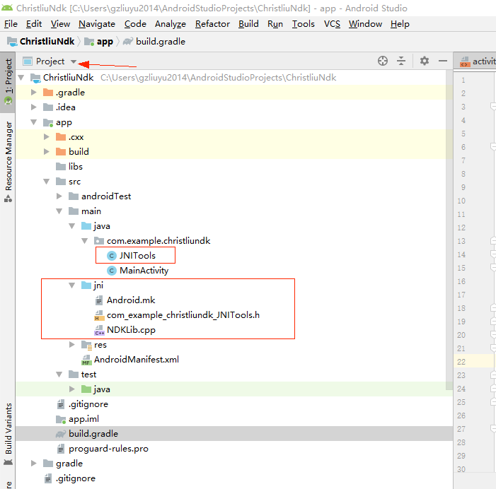
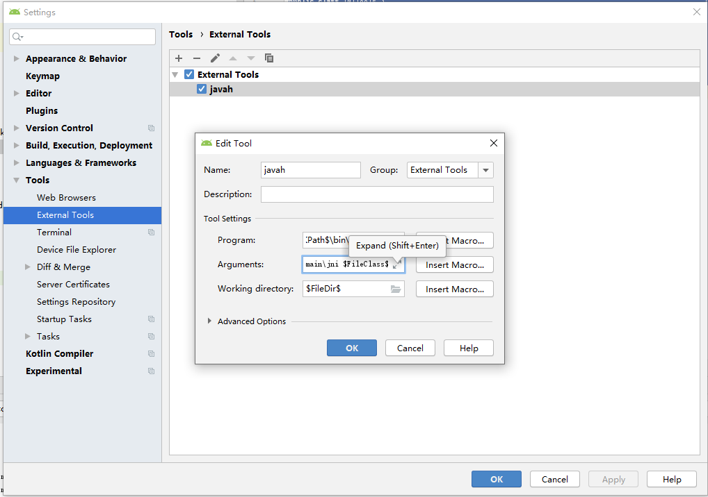
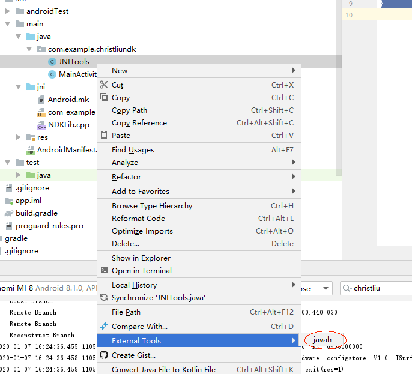

# 向已有的AS工程当中添加android.mk编译的native代码

当前版本的Android Studio(3.5.3)默认只有CMake编译native工程，而老的anroid native项目都是用Android.mk编译的，这就给我们的理解带来了困扰。为了熟悉Android.mk，本文介绍如何往一个java的android工程当中添加Android.mk编译的ndk支持。

1. 首先新建一个基本的android工程，可以是带base activity，同时保证是可以正常编译运行的。

   切换到Project视图，看一下项目的结构。

   

   上图当中红色框框标出的是最终的结果，在当前阶段是没有这些内容的。

2. 在src/main/java/com.example.christliundk下新建一个java类，JNITools。

   ~~~java
   package com.example.christliundk;
   
   public class JNITools {
       static {
           System.loadLibrary("NDKLib");
       }
   
       public native int add(int num1, int num2);
   }
   
   ~~~

3. 在src/main目录下新建一个目录，改名为jni，用来放c++的代码。

4. 为了方便将native导出的头文件放到合适的目录，配置android studio的javah环境。

   File->Setting打开项目设置，如图

   

   其中的Program, Arguments, Working directory配置如下：

   ~~~cpp
   Program: $JDKPath$\bin\javah.exe
   Arguments: -classpath $ModuleFileDir$\src\main\java -jni -d $ModuleFileDir$\src\main\jni $FileClass$
   Working directory: $FileDir$
   ~~~

5. 生成jni的头文件，在java的class上右键->External Tools ->javah

   ****

   这一步会自动在jni目录下生成头文件。

6. 设置NDK路径，如果没有安装NDK，需要提前安装NDK，可以使用SDK Manager安装。

7. 在jni目录下新建c/c++ source文件NDKLib.cpp。

   ~~~cpp
   //
   // Created by gzliuyu2014 on 2020/1/7.
   //
   
   #include <jni.h>
   #include "com_example_christliundk_JNITools.h"
   
   
   extern "C" JNIEXPORT jint JNICALL Java_com_example_christliundk_JNITools_add
           (JNIEnv *env, jobject obj, jint num1, jint num2)
   {
       return num1 + num2;
   }
   ~~~

8. 在jni目录下添加Android.mk文件。

   ~~~makefile
   LOCAL_PATH := $(call my-dir)
   
   include $(CLEAR_VARS)
   
   LOCAL_MODULE    := NDKLib
   LOCAL_SRC_FILES := NDKLib.cpp
   LOCAL_LDLIBS := -lm -llog
   include $(BUILD_SHARED_LIBRARY)
   ~~~

9. 添加C/C++引用到Gradle配置中。切换到Android视图下，项目右键->Link C++ Project with Gradle. 选择ndk-build，再选择上一步新建的Android.mk文件。

10. 以上之后就可以在java当中调用JNI的函数了。比如可以在onCreate当中这样写：

    ~~~java
    import com.example.christliundk.JNITools;
    ...
    int num = new JNITools().add(1, 2);
    ~~~

    